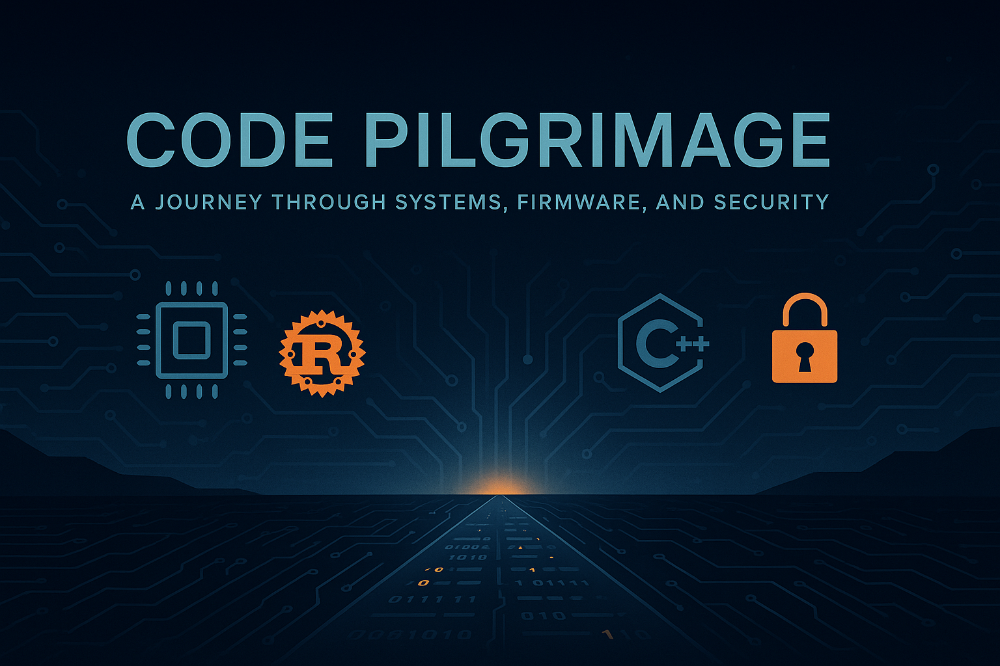

<!-- Banner -->

  

  

<h1 align="center">👋 Welcome to Code Pilgrimage 👣</h1>

<i>Exploring embedded systems, firmware, and digital security.</i>

---

## 🛠️ What I Work On
- 🧩 **AUTOSAR Classic** — Diagnostics (DCM), COM stack
- ⚙️ **Embedded Systems** — Real-time, MCU-focused development
- 🦀 **Rust & C++** — Safe, modern, systems-level programming
- 🔐 **Cryptography** — Learning through practice and curiosity

---

## 🧭 My Current Journey
- ⛰️ **C++ Mastery** for Adaptive AUTOSAR & HPC-based platforms  
- 🌲 Building a Linux-based client-server project using **vsomeip**  
- 🔍 Deep diving into **Cybersecurity & ISO 26262**

---

## 📚 Featured Pilgrimage Logs (Blog/Notes)
> Visit [codepilgrimage.github.io](https://codepilgrimage.github.io) for blog posts

---

## 🌱 In Progress
- 🧠 Learning Plan: Rust, C++, Crypto, Linux
- 🐧 QEMU-based Linux workspace for embedded dev
- 📖 Notes from *Serious Cryptography*, *Modern C++*, and more

---

## ✨ Connect With Me
- 🔗 [Email](blog.rakuram@gmail.com)
- 🗃️ [GitHub Repos](https://github.com/codepilgrimage)
- [My Website](https://codepilgrimage.github.io)
---

*“Not all those who wander are lost.” – J.R.R. Tolkien*  

🌌 Thanks for visiting my code pilgrimage.
